# This is the repo of AISO's website
> This site hosts the source of AISO's website.

> This page tells you how to contribute to the project.

> This page also tells you how to do the daily maintain of the website.

## Intro
This page use Gitee's build-in function `Gitee Pages` and the popular [Jekyll](https://jekyllrb.com/) to create a beautiful static site. The theme is forked from https://github.com/qiubaiying/qiubaiying.github.io .

## Contribute to the project
If you are familiar with GitHub, just pull requests.
If you are not, just learn to use it in [GitHub skills](https://skills.github.com/):joy:, or contact the maintainer by email `JialinHe_Plusero@outlook.com`.

## For Maintainers

按顺序阅读，即可学会用Gitee Pages部署网站。

### 使用Gitee Pages

1. 注册Gitee账号，随便选一个名字就好。比如LaserLabHITSZ，那么网站后续的域名会是`LaserLabHITSZ.gitee.io`。

    [Gitee - 企业级 DevOps 研发效能平台](https://gitee.com/)

2. fork一下原有的网站[plusero: a test for group blog (gitee.com)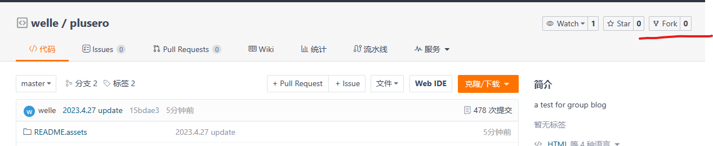](https://gitee.com/plusero/plusero)

3. 选择在`服务`中选择Gitee Pages，并启动。新账号会要求你实名验证，上传下实名信息就好了。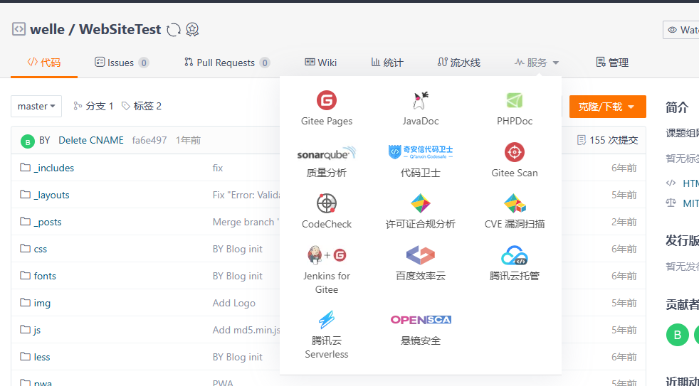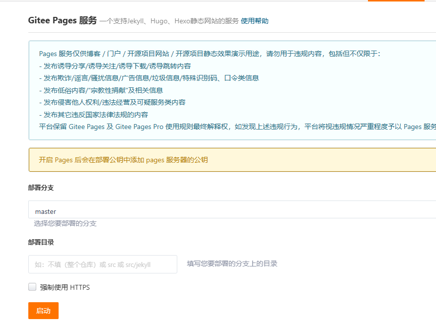

4. 部署完成后，就可以查看你的网站啦~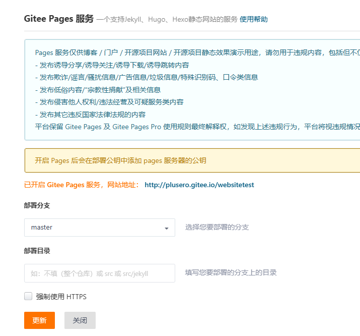

### 使用GitHub Desktop管理项目

如果你不会Git，请查看以下教程关于GitHub的部分。

[博客搭建详细教程 · qiubaiying/qiubaiying.github.io Wiki](https://github.com/qiubaiying/qiubaiying.github.io/wiki/博客搭建详细教程#利用githhub-desktop管理github仓库)

由于需要照顾到国内用户，本项目会使用Gitee Pages来代替GitHub Pages，两者的操作几乎一致，所以不用担心只学了GitHub而不会使用Gitee。

### 更新首页新闻

更新前首页如下：

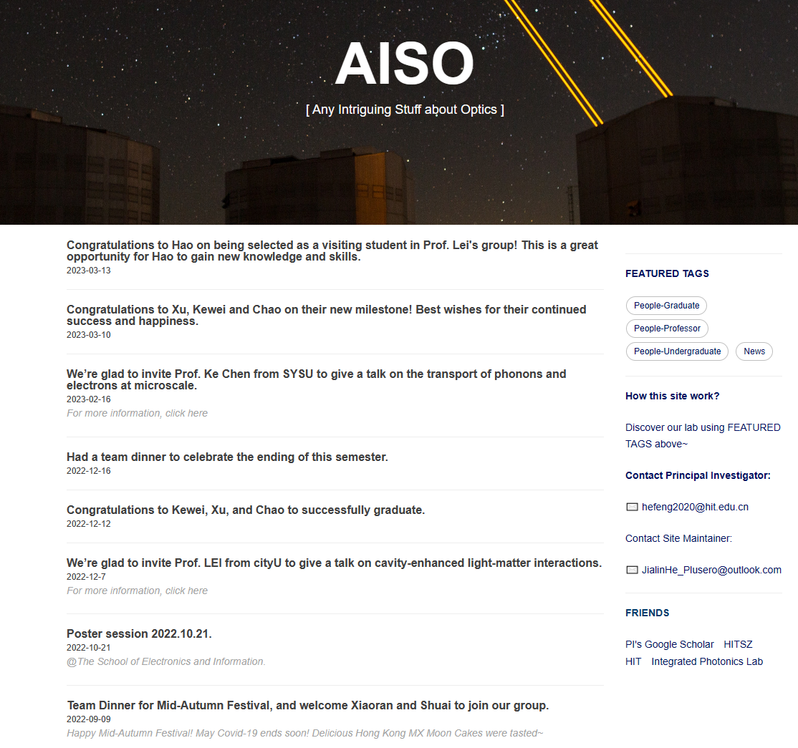

1. 打开`_posts` 文件夹，新增一个按日期命名`.md`文件。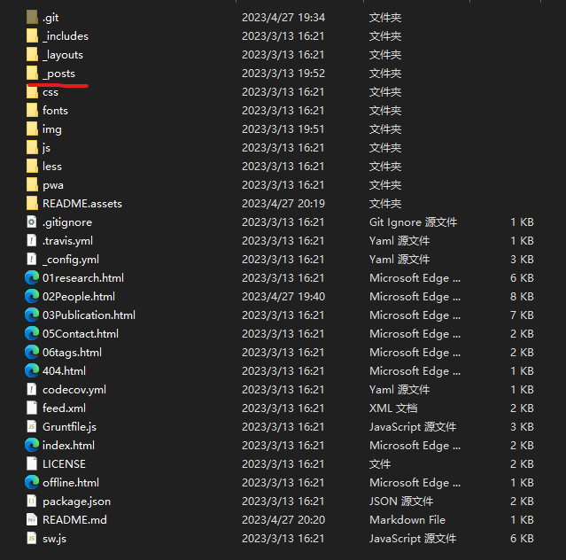

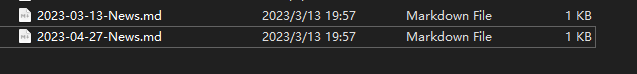

2. 编辑`.md`文件的内容。例如：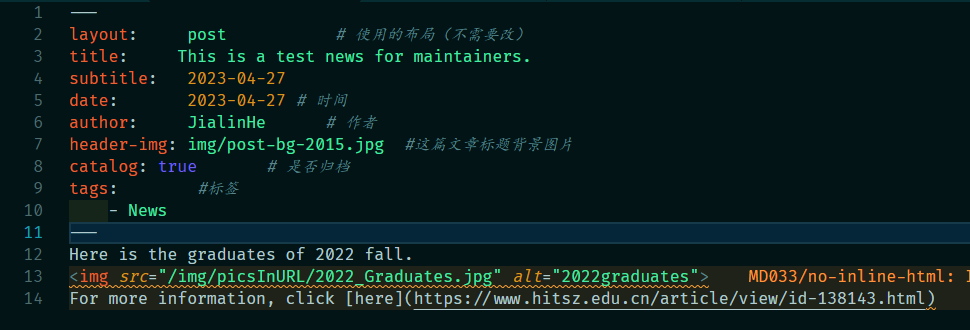

    其中，两条横线之间（在此文件中是第1行，第11行之间）是文件的格式信息。后面为图文消息。文本直接输入即可，图片和超链接可以按照13行、14行类似的方式插入。本项目所有图片均放在项目根目录的`img`文件夹下，需要使用图片时，按照类似第13行的格式引用即可。

3. 使用GitHub Desktop或者命令行commit更改，并更新Gitee Pages即可。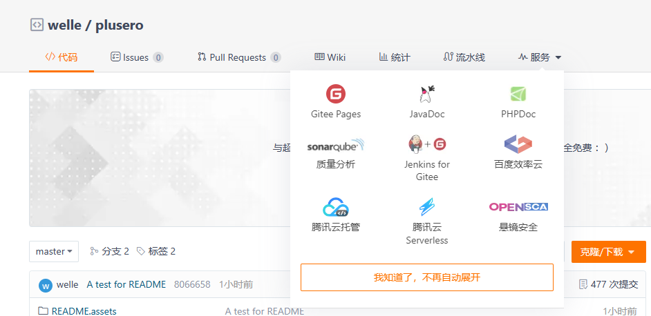
  更新后网站，效果如下图：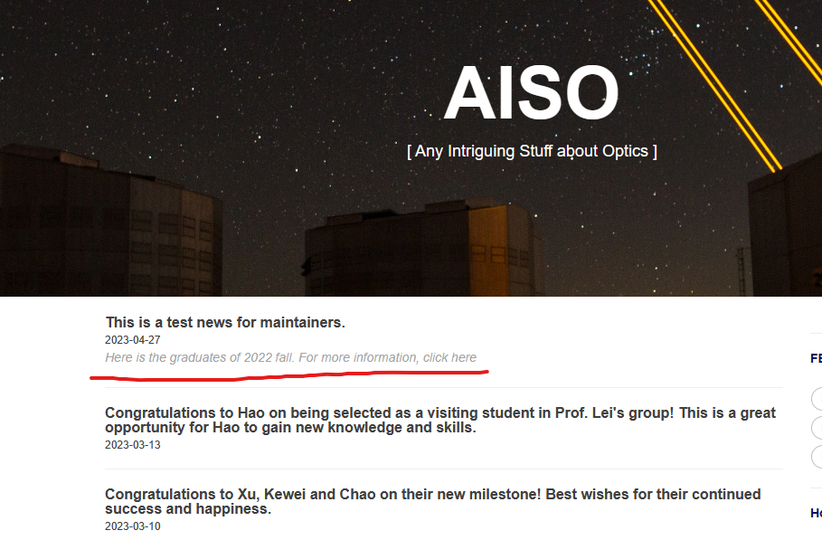

  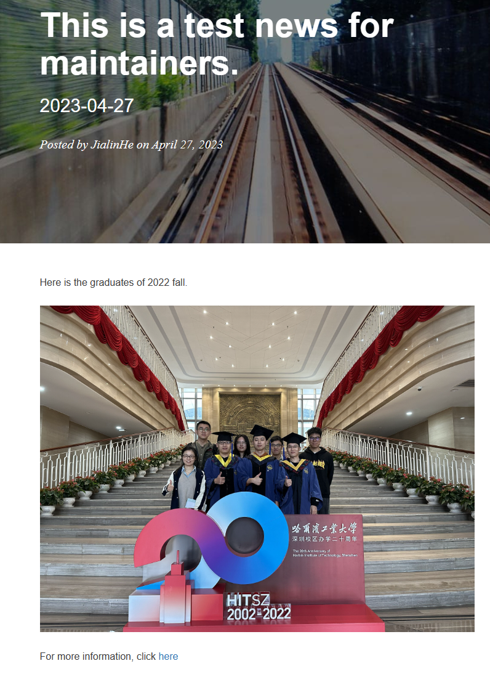

### 更新主页面内容

主页面与文件夹中的`html`文件对应。

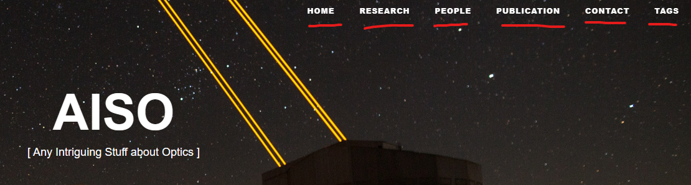

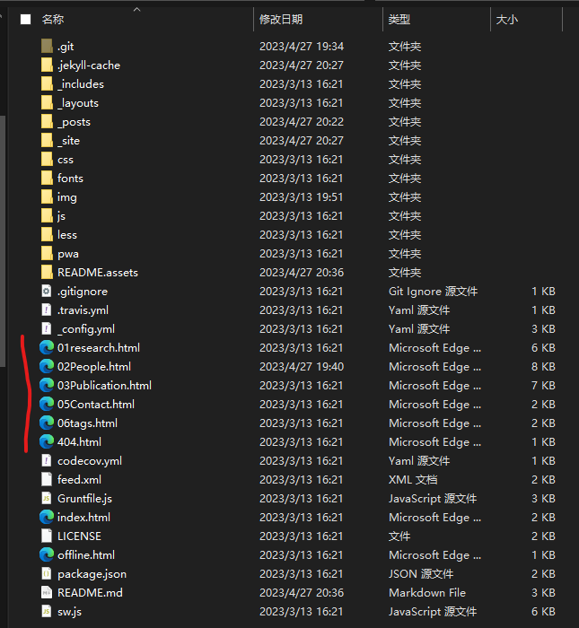

编辑对应的`html`文件，即可更改主页内容。更新内容时无需进行系统性学习，参考原有内容进行编辑即可，因为HTML的标记语法非常简单。例如：`<h2>xxx</h2>`为二级标题，`
xxx
`为分段，`<strong>xxx</strong>`为加粗。

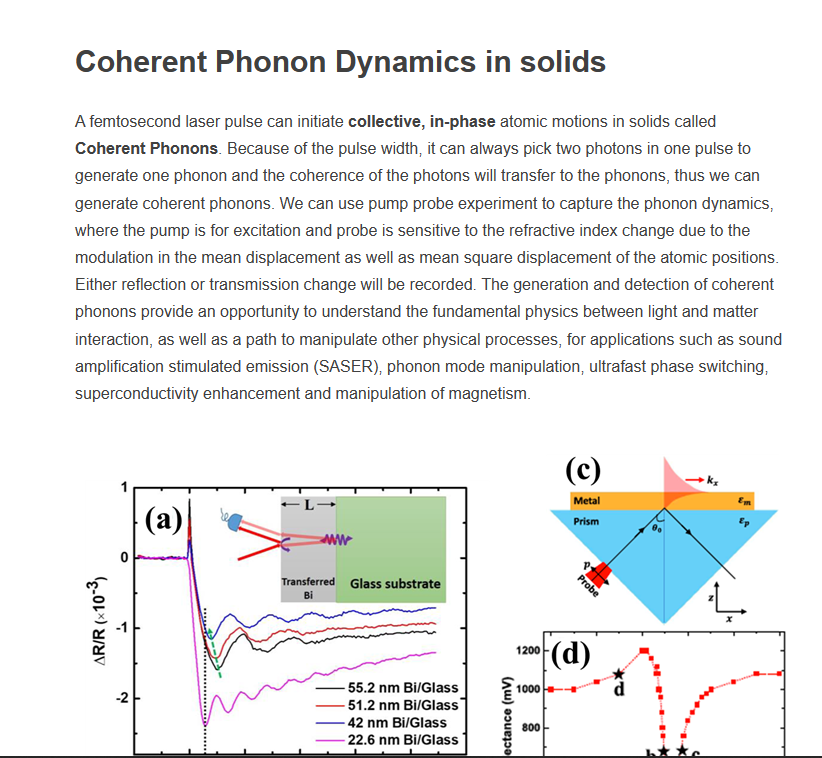

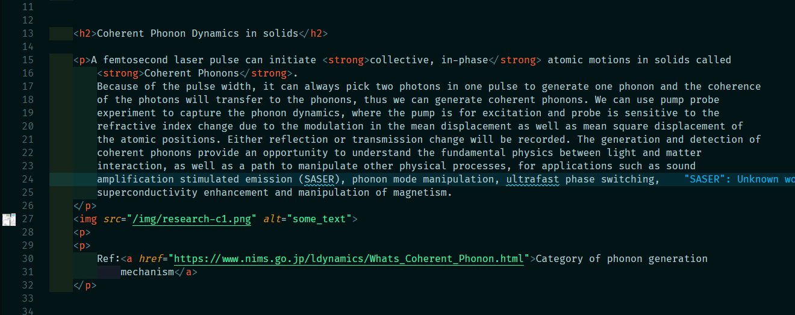

### 本地调试

[博客搭建详细教程 · qiubaiying/qiubaiying.github.io Wiki](https://github.com/qiubaiying/qiubaiying.github.io/wiki/博客搭建详细教程#在本地调试博客)

